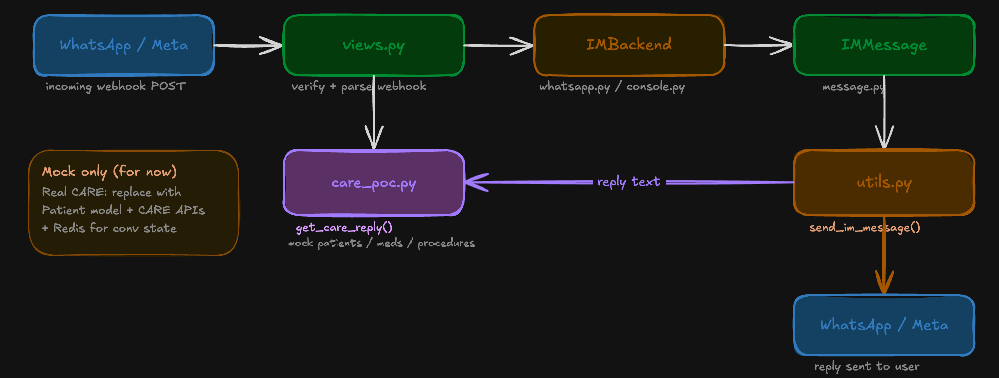

# care_im — IM plugin for CARE

Small PoC that adds IM (WhatsApp etc.) to [CARE](https://github.com/ohcnetwork/care), same idea as its SMS backend. GSoC 2026 mini-PoC.

## Architecture



- Two backends: console (dev/tests), WhatsApp Cloud API. Both do `send_message` / `receive_message`.
- PoC bot uses buttons + list; state is in-memory here — real deployment would use Redis (CARE has it).
- Drop into any Django project via `INSTALLED_APPS`; recipient is always a single string.

**Real CARE:** This repo uses mock data and in-memory state. In production you’d plug in CARE’s Patient (and related) models, Redis for state, and WhatsApp with real creds.

## Quick Start

**Demo (standalone):**

```bash
git clone <repo-url> && cd care_im
pip install -e ".[dev]"
cp .env.example .env   # fill in Meta API creds if using WhatsApp
python manage_demo.py runserver
```

**As a CARE plugin:** add `care_im` to `INSTALLED_APPS`, set `IM_BACKEND` to the WhatsApp backend, add the usual `WHATSAPP_*` settings, and in `urls.py`:

```python
path("im/", include("care_im.urls")),
```

**Send a message:** `from care_im.utils import send_im_message` then `send_im_message(content="Hi", recipient="919876543210")`.

## Tests

```bash
python manage_demo.py test care_im.tests -v2
```

Or: `python -m django test care_im.tests --settings=test_settings -v2`

## Lint / format

```bash
ruff check care_im/
ruff format care_im/
```

`pre-commit install` if you use it.

## Project layout

`care_im/` — `message.py`, `utils.py`, `views.py`, `urls.py`, `care_poc.py` (bot + mock data), `backends/` (base, console, whatsapp), `tests/test_views.py`. Demo runner is `manage_demo.py` at repo root.
